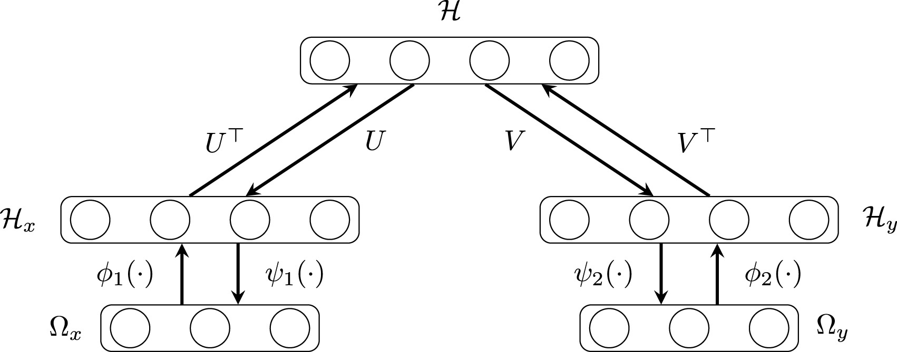

# Adversarial Robustness in Generative Restricted Kernel Machines

This repository was written in the scope of the Master thesis **"Adversarial Robustness in Generative Restricted Kernel Machines"** under the supervision of **Prof. Suykens**. It contains tools to generate adversarial examples against deep generative models and assess the performance of the models. These tools are combined into one class called `class_Adv_attack_genRKM`. Moreover, it comprises a latent analysis of the genRKM trying to discover the origin of the adversarial robustness.

## Table of Contents
1. [Authors](#authors)
2. [Promotor and Daily Advisors](#promotor-and-daily-advisors)
3. [Purpose of the Master Thesis](#purpose-of-the-master-thesis)
4. [Models](#models)
5. [Tools](#tools)
6. [Metrics](#metrics)
7. [Explanation of Content](#explanation-of-content)
8. [Credits](#credits)
9. [References](#references)
10. [Contact](#contact)

## Authors

- **Naichuan Zhang** and **Grégoire Corlùy**, students in the Master of Statistics and Data Science at KU Leuven.

## Promotor and Daily Advisors

- **Promotor:** Prof. dr. ir. Johan Suykens
- **Daily Advisors:** ir. Sonny Achten and ir. Bram De Cooman

## Purpose of the Master Thesis

In this thesis, the goal is to improve and analyze the adversarial robustness of the genRKM, ideally using the good properties of this particular model. The analysis can be divided into four distinct parts, from which the first three are included in this repository (corresponding folder given between parentheses):

1. **Compare the performance of a vanilla VAE with a vanilla genRKM against state-of-the-art attacks** to observe which model has inherently adversarial robustness properties (`Comparison-vanilla-models`).
2. **Compare the performance of an adversarially-trained VAE with an adversarially-trained genRKM** to see which model benefits the most from this effective adversarial defense (`Comparison-adv-trained-models`).
3. **Perform a latent space analysis** by comparing the latent space of a vanilla and adversarially-trained genRKM, trying to understand the origin of the adversarial robustness (`Latent-space-analysis`).
4. **Comparison of the newly implemented robust genRKM models with the vanilla and adversarially-trained VAE and genRKM** (previously introduced) (See [repository](https://github.com/zncQueiros/Adversarial_Robustness_Generatieve_RKM.git)).

## Models

The genRKM [1] is based on the RKM framework [2], invented by Johan Suykens, which uses the synergies of the kernel PCA, Least-Squares Support Vector Machines, and Restricted Boltzmann Machine. It is a generative model with interesting properties like latent space disentanglement and multiview.

The architecture of the genRKM is given below.

## Tools

The adversarial attacks and some adversarial defenses implemented in this thesis are based on state-of-the-art methods:
- **PGD attack for adversarial training:** Madry [3]
- **Attack in the latent space:** Tabacof [4] (implemented, but not used in the analysis)
- **Untargeted and targeted type 2 attacks:** Sun [5]

## Metrics

- **Adversarial attacks:** To measure the similarity between images, three metrics were used: Frobenius norm, Structural Similarity Index Measure (SSIM), and Learned Perceptual Image Patch Similarity (LPIPS).
- **Latent space analysis:** To measure the similarity between latent vectors, the cosine similarity and the Euclidean distance were used as metrics.

## Explanation of Content

- **Comparison-adv-trained-models:** Two Jupyter notebooks to perform the analysis of the comparison between the adversarially-trained VAEs and genRKMs on untargeted and targeted attacks, respectively. This means performing multiple adversarial attacks, measuring the effectiveness of the attacks, and visualizing the results.
- **Comparison-vanilla-models:** One Jupyter notebook similar to the ones for the adversarially-trained models to perform the analysis of the comparison between the vanilla VAEs and genRKMs on untargeted attacks only. This means performing multiple adversarial attacks, measuring the effectiveness of the attacks, and visualizing the results.
- **Latent-space-analysis:** Three Jupyter notebooks to perform the different latent space analyses:
  - `latent-one-view`: Measures the similarity of the latent spaces in different ways.
  - `latent-one-view-interpretation`: Provides an interpretation of the latent components which are the most similar or dissimilar.
  - `latent-one-view-effect`: Visualizes the effect of adversarial attacks on the latent vector of the vanilla and robust genRKMs.
- **Training:** Files to train the vanilla and adversarially-trained VAEs and genRKMs.
- **Utilities:** Files containing the tools to generate the adversarial attacks and to define the architecture of the VAE and genRKM.
  - `utils.py`: Loads the genRKM architecture and the MNIST data.
  - `Architecture_VAE.py` and `Architecture_VAE_large.py`: Define the basic and extended architecture of the VAE.
  - `class_Adv_attack_genRKM`: Contains all the tools to generate, measure, and visualize the adversarial attacks on the VAE and genRKM.

## Credits

The code builds on the work of **Arun Pandey** concerning the genRKM. For the VAE, the code is inspired by **Jackson Kang**. The adversarial training code was inspired by the repository of **Madrylab**.

- Link to the repository of [Arun Pandey](https://www.esat.kuleuven.be/stadius/E/pandey/softwareGenRKM.php)
- Link to the repository of [Jackson Kang](https://github.com/Jackson-Kang/Pytorch-VAE-tutorial)
- Link to the repository of [Madrylab](https://github.com/MadryLab/mnist_challenge)

## References

1. Pandey, A., Schreurs, J., & Suykens, J. A. (2021). Generative restricted kernel machines: A framework for multi-view generation and disentangled feature learning. *Neural Networks, 135*, 177-191. [Link](https://doi.org/10.1016/j.neunet.2020.11.016)
2. Suykens, J. A. (2017). Deep restricted kernel machines using conjugate feature duality. *Neural computation, 29*(8), 2123-2163. [Link](https://doi.org/10.1162/neco_a_00981)
3. Madry, A., Makelov, A., Schmidt, L., Tsipras, D., & Vladu, A. (2017). Towards deep learning models resistant to adversarial attacks. *arXiv preprint arXiv:1706.06083*. [Link](https://arxiv.org/abs/1706.06083)
4. Tabacof, P., Tavares, J., & Valle, E. (2016). Adversarial images for variational autoencoders. *arXiv preprint arXiv:1612.00155*. [Link](https://arxiv.org/abs/1612.00155)
5. Sun, C., Chen, S., Cai, J., & Huang, X. (2020, October). Type I attack for generative models. In *2020 IEEE international conference on image processing (ICIP)* (pp. 593-597). IEEE. [Link](https://doi.org/10.1109/ICIP40778.2020.9190868)

## Contact

For more information, please contact: **Gregoire.stephane.corluy@ulb.be**
